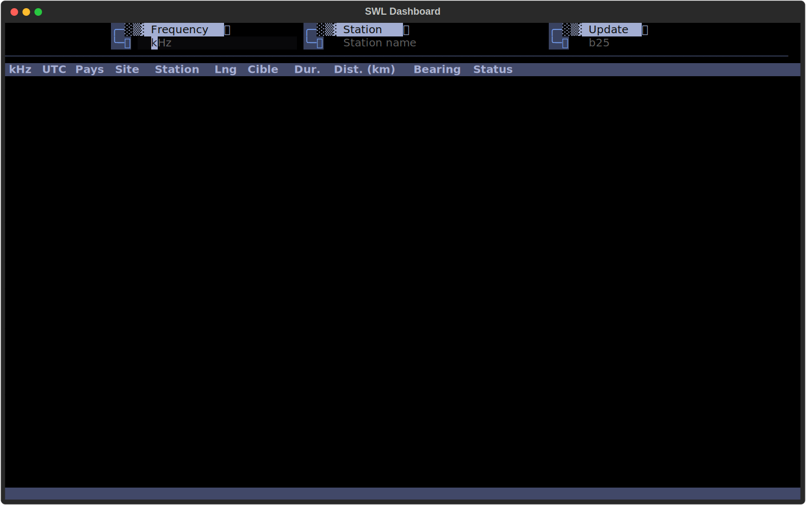
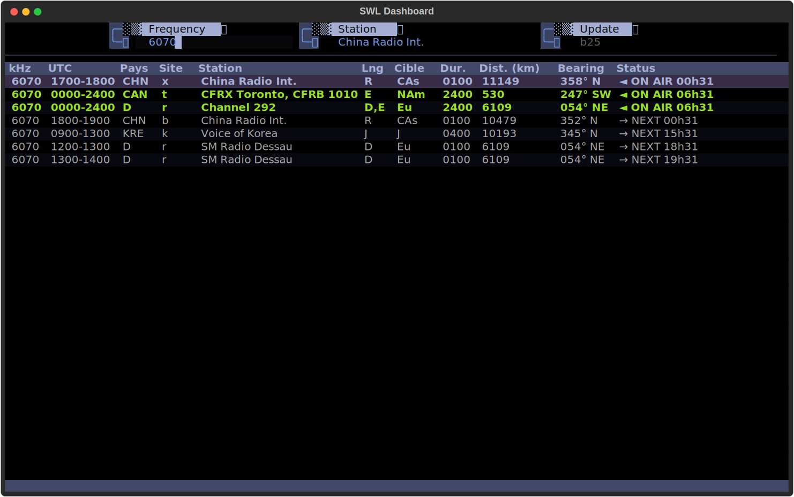
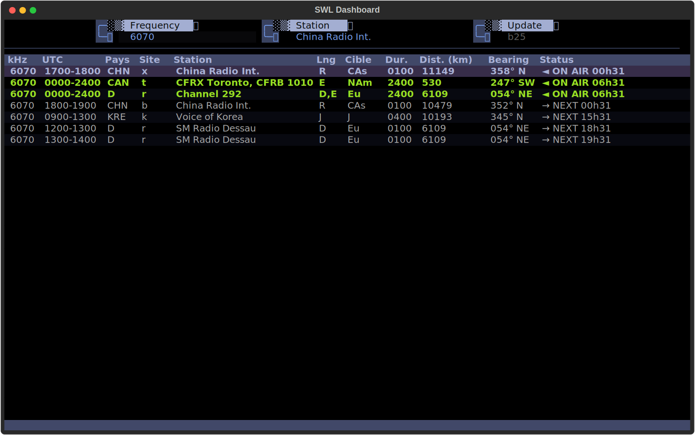
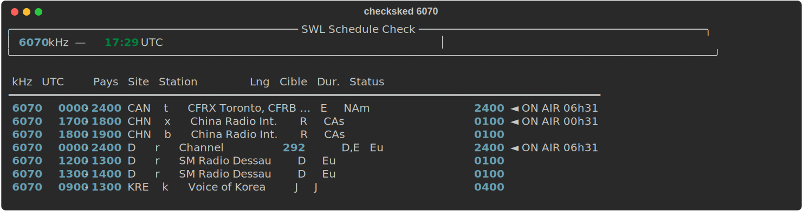

# SWL Schedule Tool

A collection of tools for shortwave listeners (SWL) to check broadcast schedules and find active stations.

## Overview

This project provides utilities to query and display shortwave radio broadcast schedules from the EiBi (Eibi) database. The main tool allows you to check which stations are currently broadcasting on a specific frequency.

## Screenshots

### Interactive TUI Dashboard

<p align="center">
  
</p>

### Frequency Search Results

Search results for 6070 kHz with ON AIR highlighting, distance, and bearing from QTH:

<p align="center">
  
</p>

### Station Detail Modal

<p align="center">
  
</p>

### CLI Schedule Check (`checksked`)

<p align="center">
  
</p>

## Features

- **Interactive TUI Dashboard**: Full-screen terminal UI with live UTC clock, frequency search, bearing and distance display
- **Real-time Schedule Checking**: Query current broadcasts on any frequency
- **azMap Integration**: Press `m` to show transmitter location on an azimuthal map; reuses a running azMap window via IPC
- **Bearing & Distance**: Great-circle distance and compass bearing from your QTH to each transmitter site
- **UTC Time Display**: All times shown in UTC for international coordination
- **Active Station Highlighting**: Currently broadcasting stations are highlighted in bold green
- **Next Broadcast Display**: Inactive stations show time until next broadcast in light grey
- **Remaining Time Display**: Shows how much time is left for active broadcasts
- **Midnight Crossing Support**: Correctly handles broadcasts that span across midnight
- **Multi-language Support**: Displays station language and target area information
- **Transmitter Site Extraction**: Extracts transmitter sites with GPS coordinates to JSON
- **Integrated Schedule Updates**: Update EiBi data directly from the TUI

## Installation

### From PyPI

```bash
pip install eibi-swl-dashboard
```

This installs three commands: `swl`, `checksked`, and `updatesked`.

### From source (development)

```bash
git clone https://github.com/mikewam/swl-tools.git
cd swl-tools
pip install -e .
```

### Arch Linux

```bash
cd packaging/archlinux
makepkg -si
```

This installs the entry points (`swl`, `checksked`, `updatesked`) and a desktop entry for application menu integration.

### Standalone binary

Build a self-contained executable (~16MB) that bundles Python and all dependencies — no Python installation required on the target machine:

```bash
python -m venv .venv && .venv/bin/pip install -e . pyinstaller
.venv/bin/pyinstaller --onefile --name swl \
  --add-data "src/eibi_swl/countrycode.dat:eibi_swl" \
  --add-data "src/eibi_swl/targetcode:eibi_swl" \
  --add-data "src/eibi_swl/transmittersite:eibi_swl" \
  --add-data "src/eibi_swl/swlconfig.conf.sample:eibi_swl" \
  --add-data "src/eibi_swl/swl-schedules-data:eibi_swl/swl-schedules-data" \
  --hidden-import=textual --hidden-import=rich \
  --collect-all=textual --collect-all=rich \
  --paths=src src/eibi_swl/swl.py
```

The binary is output to `dist/swl`.

## Configuration

Create or edit `swlconfig.conf` in the project root with your QTH (station location) and optional radio connection:

```ini
[qth]
lat = 45.5017
lon = -73.5673
name = Montreal, QC

[radio]
host = localhost
port = 4532
```

The `[qth]` section is used to calculate bearing and distance to each transmitter site. The `[radio]` section configures the connection to the EladSpectrum CAT server for the `t` (tune) key. Radio settings can also be set via `--host` and `--cat-port` CLI flags.

## Usage

### Interactive TUI Dashboard

```bash
swl
swl --host 192.168.1.50 --cat-port 4532
```

The `--host` and `--cat-port` flags are saved to the config file, so subsequent runs remember the connection without needing the flags again.

Launches a full-screen terminal dashboard with:
- Tokyo Night theme with black background
- Starship-style powerline input prompts (requires Nerd Font)
- Two inputs: **Frequency** (kHz, press Enter to search) and **Update** (schedule period like `b25`, press Enter to download)
- Live UTC clock
- Schedule table with distance (km) and bearing from your QTH
- ON AIR highlighting (bold green) for active broadcasts
- NEXT time display (light grey) for upcoming broadcasts
- Station detail modal on row select (Enter)
- Press `m` to open the selected station in [azMap](https://github.com/mikewam/azMap) (azimuthal map)
- Press `F5` to update schedules, `q` or `Escape` to quit

### Check Stations on a Frequency

```bash
checksked <frequency_in_kHz>
```

**Example:**
```bash
checksked 1170
```

**Output:**
```
Stations en onde à la fréquence 1170 kHz en ce moment -> 14:46 UTC

1170 kHz 0000-0350 UTC Pays: KOR Site: k      Station: KBS Hanminjok            Langue: K   Cible:   FE 0350
1170 kHz 0950-1000 UTC Pays: KOR Site: k      Station: KBS Hanminjok            Langue: K   Cible:   FE 0050
1170 kHz 1400-2400 UTC Pays: KOR Site: k      Station: KBS Hanminjok            Langue: K   Cible:   FE 1000 ◄ ON AIR (reste: 09h14)
1170 kHz 1000-1100 UTC Pays: KOR Site: k      Station: KBS World Radio          Langue: K   Cible:   FE 0100
...
```

### Update Schedule Data

```bash
updatesked <schedule_period>
```

**Example:**
```bash
updatesked b25
```

Downloads the latest EiBi schedule data for the specified season (`a` = summer, `b` = winter, followed by 2-digit year). Also extracts transmitter site locations and coordinates into `transmitter-sites.json`:

```json
[
  {
    "country": "AFG",
    "site_code": "k",
    "name": "Kabul / Pol-e-Charkhi",
    "lat": 34.5333,
    "lon": 69.3333
  }
]
```

## Data Format

The tool reads schedule data from CSV files in the `swl-schedules-data/` directory. The CSV format includes:

- **kHz**: Frequency in kilohertz
- **Time(UTC)**: Broadcast time range in UTC (HHMM-HHMM format)
- **Days**: Days of operation (if applicable)
- **ITU**: Country code
- **Station**: Station name
- **Lng**: Language code
- **Target**: Target area
- **Remarks**: Additional information
- **P**: Priority/Power indicator
- **Start/Stop**: Start and stop dates

## Schedule Files

- `sked-current.csv`: Current season's broadcast schedule
- `transmitter-sites.json`: Transmitter sites with decimal lat/lon coordinates
- `sked-a25.csv`: A25 season schedule (example)

## Output Fields

- **Pays**: Country code (3 letters)
- **Site**: Transmitter site location code
- **Station**: Broadcasting station name
- **Langue**: Language code (e.g., K=Korean, J=Japanese, E=English)
- **Cible**: Target area (e.g., FE=Far East, SAf=South Africa)
- **Duration**: Broadcast duration in HHMM format
- **◄ ON AIR HHhMM**: Indicator for currently active broadcasts with remaining time (bold green)
- **→ NEXT HHhMM**: Time until next broadcast for inactive stations (light grey)

## Language Codes

Common language codes used:
- `E`: English
- `F`: French
- `S`: Spanish
- `K`: Korean
- `J`: Japanese
- `R`: Russian
- `M`: Mandarin Chinese
- `A`: Arabic
- `P`: Portuguese

## Target Area Codes

Common target area codes:
- `FE`: Far East
- `SEA`: Southeast Asia
- `Eu`: Europe
- `NAf`: North Africa
- `SAf`: South Africa
- `ME`: Middle East
- `SAs`: South Asia
- `NAm`: North America

## Requirements

- Python 3.x
- Standard library modules: `sys`, `os`, `csv`, `datetime`, `json`, `re`, `configparser`, `math`
- External: `rich` (install via `pip install rich` or `pacman -S python-rich`)
- External: `textual` (install via `pip install textual` or `pacman -S python-textual`) — required for `swl.py`
- A [Nerd Font](https://www.nerdfonts.com/) terminal font — required for powerline glyphs in `swl.py`

## Contributing

Contributions are welcome! Please feel free to submit pull requests or open issues for bugs and feature requests.

## Data Source

Schedule data is based on the EiBi (Eibi) shortwave broadcast schedule database.
http://eibispace.de/

## License

GPLv3

## Author

Michel Lachaine, mike@mikelachaine.ca

## Acknowledgments

- EiBi for providing comprehensive shortwave broadcast schedules